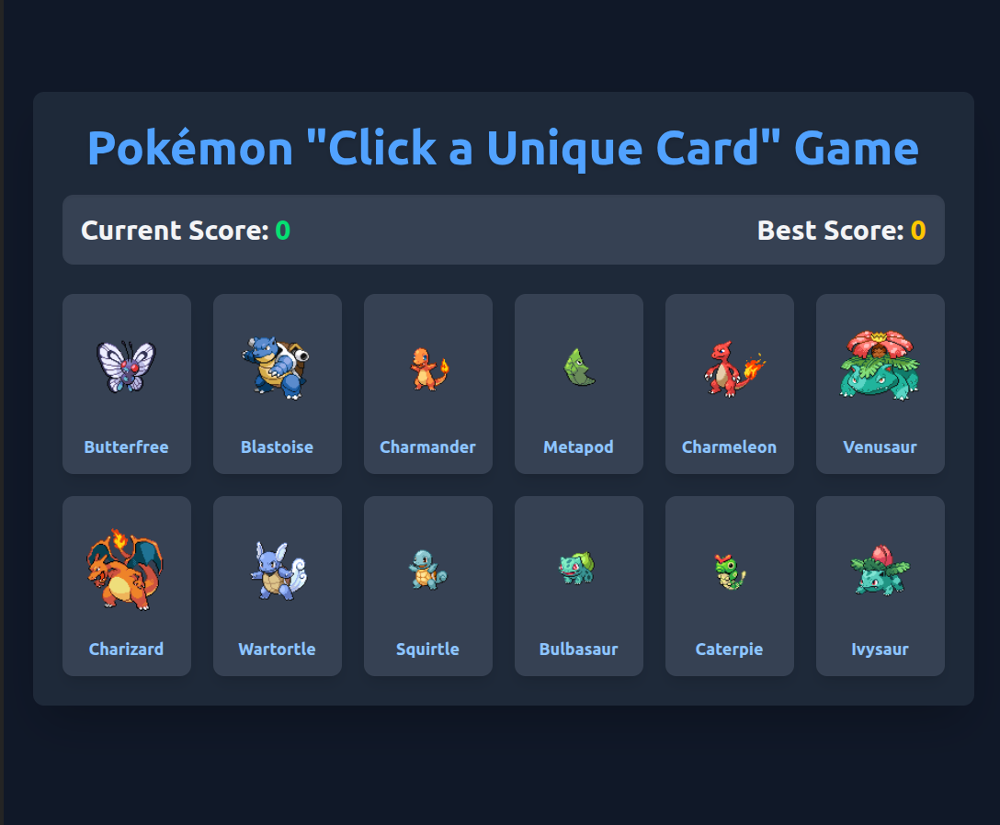

# 🧠 Memory Card Game

This is a simple memory card game built with React. The objective is to click on each card only once to earn points. If you click on a card you've already selected, the game resets.



---

## 🚀 Live Demo

You can play the game live here: [live Preview](https://memory-card-8jk.pages.dev/)

---

## 🛠 Features

Scoreboard: Tracks your current score and the highest score achieved.

Unique Cards: The game fetches a new set of unique Pokémon cards for each round.

Randomized Layout: The cards are shuffled and displayed in a random order after every click.

Responsive Design: The layout adjusts to fit different screen sizes.

---

## ⚙️ Tech Stack

Framework: React

Styling: Tailwind CSS

Data: Pokémon API (PokeAPI)

---

## 📁 Project Structure

```bash
MEMORY-CARD
├── eslint.config.js
├── index.html
├── package.json
├── package-lock.json
├── public
│   ├── brainFavicon.png
│   └── screenshot.png
├── README.md
├── src
│   ├── App.css
│   ├── App.jsx
│   ├── components
│   ├── index.css
│   └── main.jsx
├── structure.txt
└── vite.config.js

3 directories, 13 files
```

---

## 👉 How to Play

Click on a card to earn a point.

Every time you click a card, all the cards are shuffled.

The game ends if you click on a card you have already clicked.

Try to achieve the highest score possible!

---

## 🔧 Local Setup

To run this project on your local machine, follow these steps:

Clone the repository:
git clone https://github.com/your-username/memory-card-game.git

Navigate to the project directory:
cd memory-card-game

Install dependencies:
npm install

Start the development server:
npm run dev

The game will be available at [Link](http://localhost:5173) (or another port as specified in your console).
